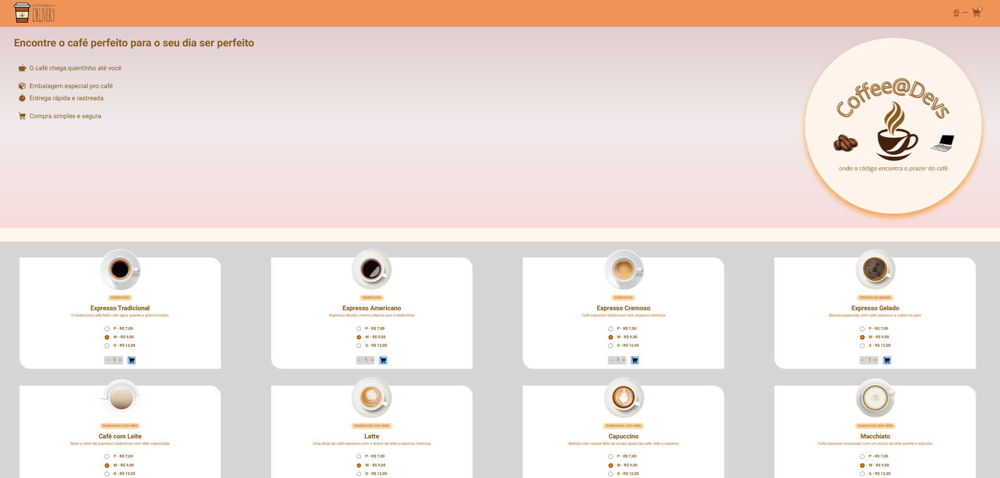
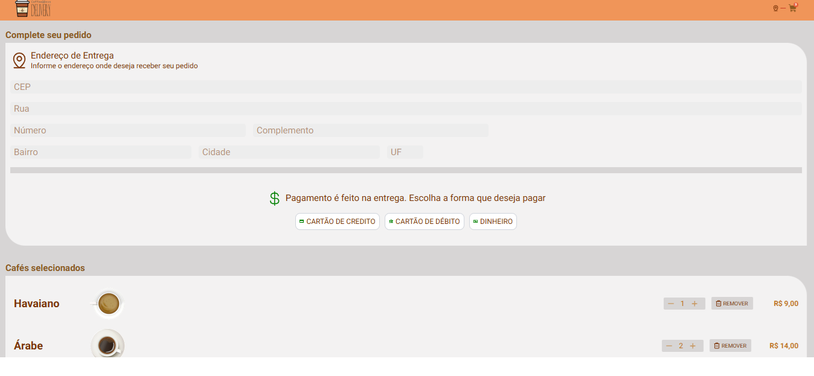
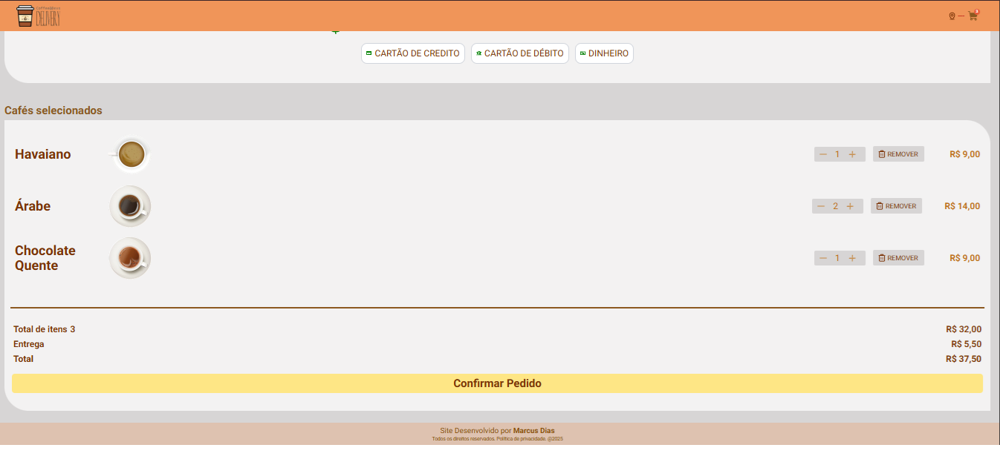
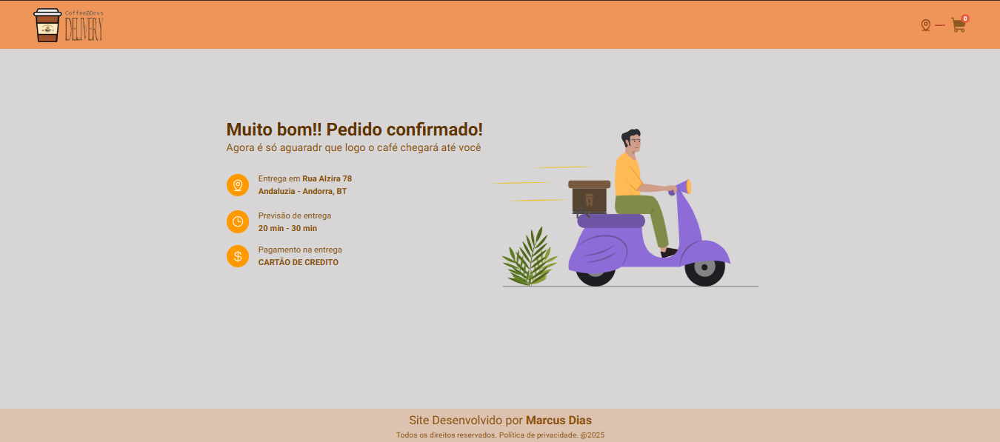

# ☕ Coffee Delivery


Aplicação de delivery de cafés desenvolvida com **React + TypeScript**.  
O projeto simula um e-commerce de cafés, com seleção de produtos, gerenciamento de carrinho e finalização de pedido.

---

## 🚀 Tecnologias

Este projeto foi construído com as seguintes ferramentas:

- [React](https://reactjs.org/) + [Vite](https://vitejs.dev/)
- [TypeScript](https://www.typescriptlang.org/)
- [React Hook Form](https://react-hook-form.com/) + [Yup](https://github.com/jquense/yup) (validações)
- [React Router](https://reactrouter.com/)
- [Phosphor Icons](https://phosphoricons.com/)
- [Font Roboto](https://fonts.google.com/specimen/Roboto)
- [Biome.js](https://biomejs.dev/) (lint/formatter)
- [npm](https://www.npmjs.com/) (gerenciador de pacotes)

---

## 🛠️ Instalação e uso

Clone o repositório e rode os comandos abaixo:

```bash
# Instalar dependências
npm install

# Rodar em modo de desenvolvimento
npm run dev

```


---

O projeto estará disponível em:
👉 http://localhost:5173


---

📸 Prints da aplicação

🏠 Página inicial



🛒 Carrinho




✅ Checkout



---

📂 Estrutura

src/ → código da aplicação

components/ → componentes reutilizáveis

data/ → base de dados local

hooks/ → hooks e lógica de formulários

layout/ → padrão replicado pela aplicação para todas as páginas

pages/ → páginas principais

routes/ → rotas de navegação entre páginas

utils/ → função utilizada de forma recorrente na aplicação

assets/ → imagens e ícones


---


📜 Licença

Este projeto está sob a licença MIT.
Sinta-se livre para usar e modificar. 😉
